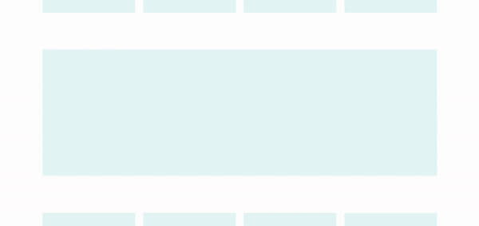

# Fullwidth animated tile prototype



## About

I choosed to use build an animated tile that showcase Omnipollo's Beers.

Omnipollo's beers are known for their funky, bold and hype style. Building a design around those traits give me a good opportunity to have fun with the animations.

## Online version

[https://theogil.github.io/legendary-couscous/](https://theogil.github.io/legendary-couscous/)

## Building and running on localhost

Install dependencies:

```sh
npm install
```

To run in hot module reloading mode:

```sh
npm start
```

To create a production build:

```sh
npm run build-prod
```

To serve production build:

```sh
npx serve dist
```

## Browser support

It has been tested using Chrome 87.0.4280.141 and FireFox 84.0.2.

It uses a bunch of modern features such as prefers-reduce-motion, focus-visible and CSS math functions.
Everything should degrade gracefully and would even work without JS.

It has not been tested with Safari and I expect some cross-browser issues with SVG animations.

## Tech stack

Vanilla JavaScript transpiled with Babel, SCSS, HTML.

I picked vanilla over a framework like React or Vue because for this particular case (quick prototype, not much state handling to do...), a framework seemed like too much overhead.

SCSS because it is awesome.

I delegate code style handling to Prettier (here using it's default settings). As long as it is consistent trough the project, I do not care _that much_ about code style.

GSAP is used to build and control animations.

Splitting.js is used to split text into individually animatable characters.

## Project architecture

```
src/
│
├── js/
│   │   // Main entry file
│   ├── index.js
│   │
│   │   // JS Components are divided into classes
│   ├── components/
│   │
│   │   // Single function files that could be used within any component
│   └── helpers/
│
└── scss/
    │   // Main entry file, no declarations here, only includes
    ├── styles.scss
    │
    │   // Component specific styles
    ├── components/
    │
    │   // Utilities, helpers, mixins, variables...
    └── abstract/
```

## Credits

App has been scaffolded with [createapp.dev](https://createapp.dev/).

Design is heavily inspired by [this Dribble shot](https://dribbble.com/shots/14723014-E-Commerce-Web-Interaction-Domingo) by Daniel Tan.

Color palette comes from [Happy Hues](https://www.happyhues.co).

Font is Woodchuck from [Rafael Vecchio](https://www.behance.net/gallery/85930915/WOODCHUCK-FREE-MODERN-SANS-SERIF-FONT-FAMILY).

Ingredients comes from [Pngtree](https://pngtree.com/).

Audio sample comes from [freesound](https://freesound.org/people/MarviinR/sounds/523322/).

The "Sound on/off" and the replay icons come from [Freepik](https://www.freepik.com/).
